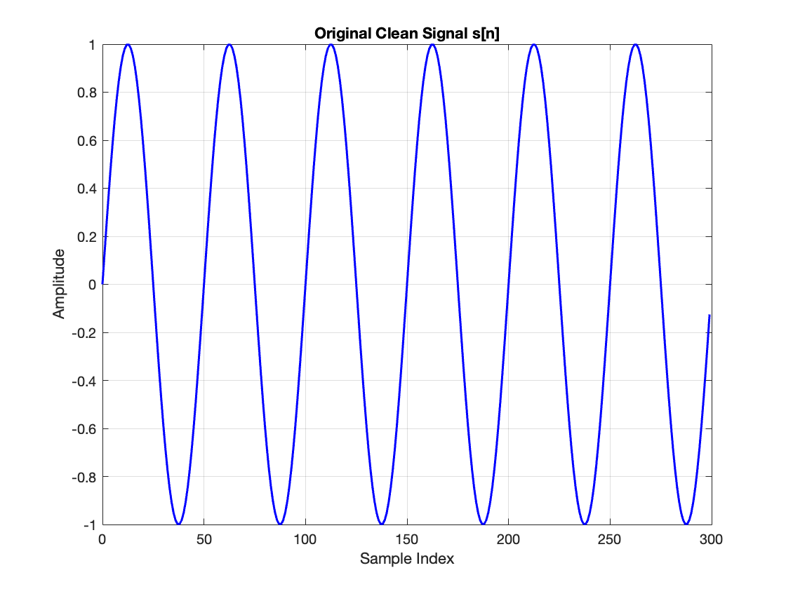
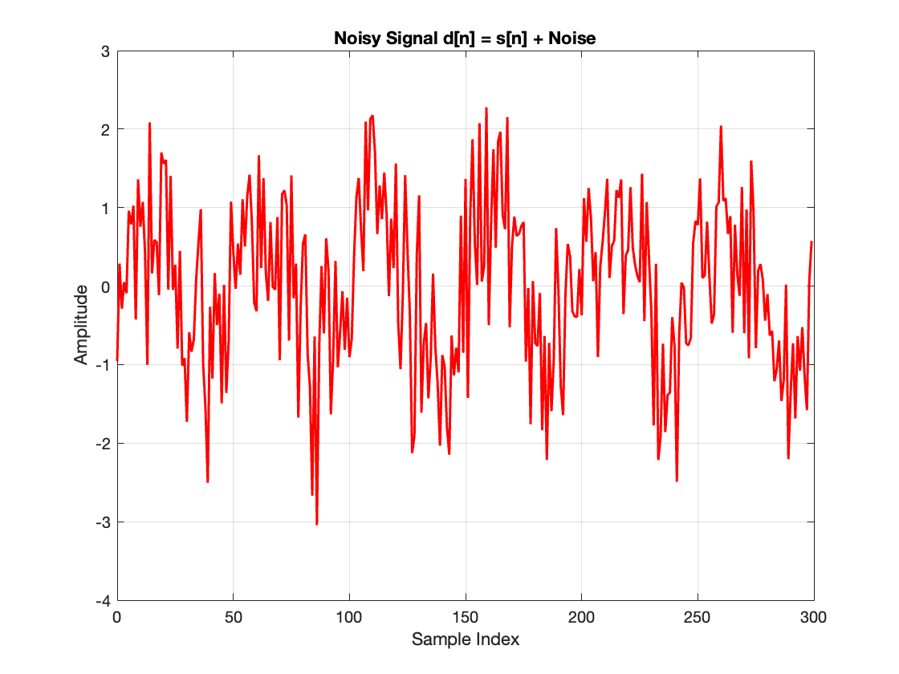
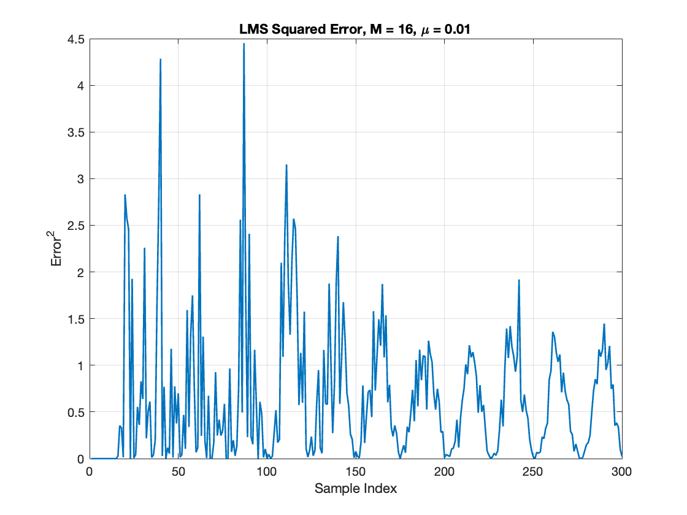
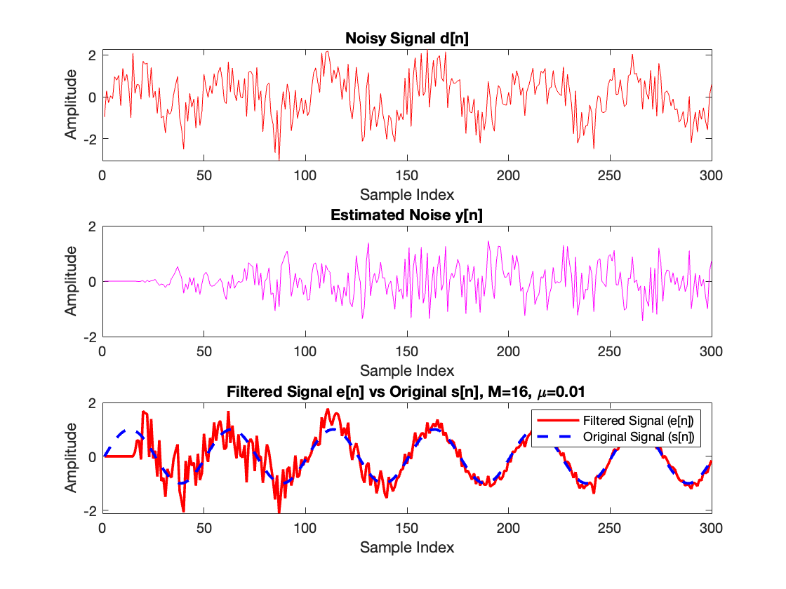

# Adaptive Noise Cancellation using LMS Algorithm 🎛️

> MATLAB implementation of an adaptive FIR filter (Least Mean Squares algorithm) that cancels correlated noise from a signal, with a full study of how filter length (M) and step size (μ) affect convergence and noise suppression.


## 📌 Overview

Adaptive Noise Cancellation (ANC) removes noise from a signal using a reference input that is correlated with the noise. This project implements the **Least Mean Squares (LMS)** algorithm — a widely used adaptive filtering technique — from scratch in MATLAB to recover a clean sinusoidal signal buried in noise.

Given:

```
d(n) = s(n) + v(n)      -> primary input (desired signal + noise)
x(n) = reference input   -> correlated with the noise v(n)
```

The adaptive filter estimates the noise component `y(n)` from `x(n)` and subtracts it from `d(n)`, producing an error signal `e(n)` that approximates the clean signal `s(n)`.

## 🧠 Algorithm

For an `M`-tap FIR filter, the output is:

```
y(n) = Σ w_k(n) x(n-k),   k = 0 ... M-1
```

The error and weight update rule (steepest-descent gradient step):

```
e(n)     = d(n) - y(n)
w(n+1)   = w(n) + μ * e(n) * x(n)
```

where `μ` is the step size, bounded by the convergence condition `0 < μ < 1 / (M * Px)`, with `Px` being the power of the reference signal.

**Performance metrics tracked:**
- Mean Squared Error (MSE) of the residual error
- Output SNR improvement: `10*log10( s² / (e - s)² )`

## 📂 Project Structure

```
adaptive-noise-cancellation-lms/
├── src/
│   └── lms_noise_cancellation.m
├── results/
│   ├── 01_clean_signal.png
│   ├── 02_noisy_signal.png
│   ├── 03_lms_learning_curve.png
│   └── 04_filtered_vs_original.png
├── LICENSE
└── README.md
```

## ▶️ How to Run

1. Open MATLAB (R2021a or later recommended).
2. Run [`src/lms_noise_cancellation.m`](src/lms_noise_cancellation.m).
3. Four figures will be generated (clean signal, noisy signal, learning curve, filtered vs. original), and MSE / SNR will be printed to the console.

No additional toolboxes are required — the script only uses base MATLAB.

## 📊 Results

**Clean signal `s[n]`**



**Noisy signal `d[n] = s[n] + noise`**



**LMS learning curve (squared error over iterations)**



**Filtered signal vs. original clean signal**



## 🔍 Observations

- Small filter lengths (`M = 4`) converge quickly but give poor noise suppression.
- Larger filter lengths (`M = 32`) suppress noise better but converge more slowly.
- A large step size (`μ = 0.01`) speeds up convergence but risks instability.
- Best trade-off observed at **M = 8, μ = 0.005**, giving stable convergence with strong noise suppression.
- SNR improved by roughly **5–8 dB** with optimal parameters.

## 🎯 Conclusion

The LMS-based adaptive filter effectively cancels correlated noise from a signal when given a suitable reference input. Filter length and step size are the two key hyperparameters controlling the trade-off between convergence speed and steady-state error.

## 👤 Author

**Divyanshu Kumar**
[GitHub](https://github.com/Divyanshukumar2005)

## 📄 License

Released under the [MIT License](LICENSE).

## 🏷️ Topics
matlab, signal-processing, adaptive-filter, lms-algorithm, noise-cancellation, dsp
